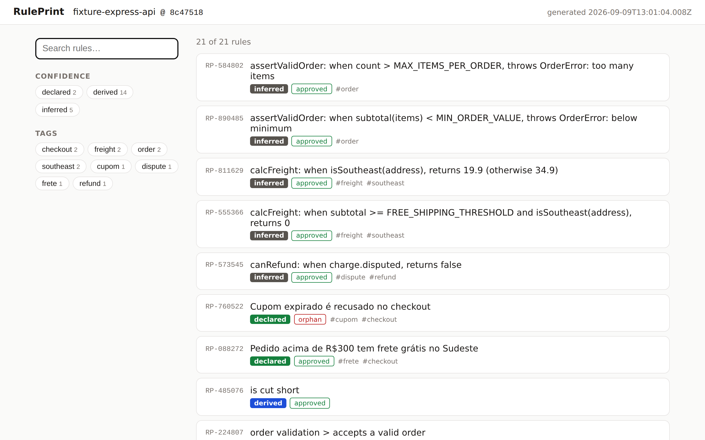
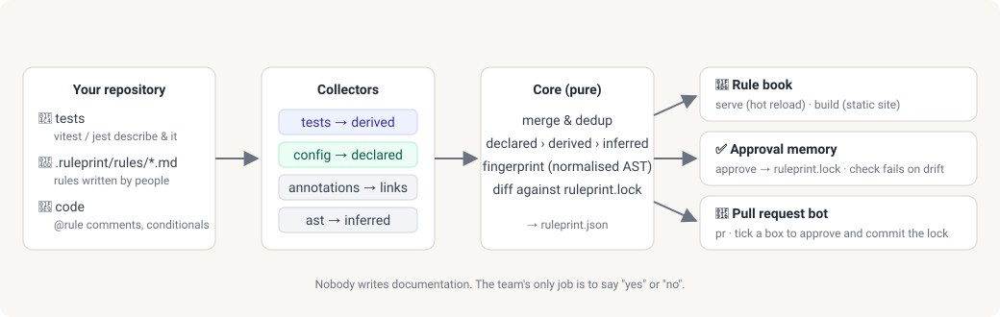
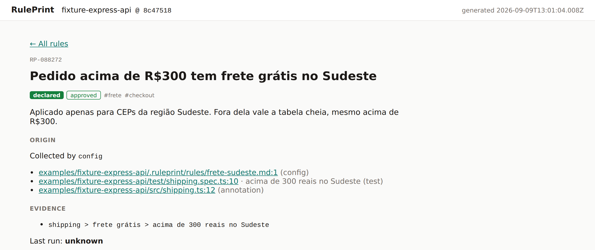

<h1 align="center">RulePrint</h1>

<p align="center">
  <strong>A browsable book of business rules, generated from the code your team already writes.</strong><br>
  No documentation to maintain. Your only job is to say "yes".
</p>

<p align="center">
  <a href="https://github.com/cedric-sd/Ruleprint/actions/workflows/ci.yml"></a>
  <a href="LICENSE"></a>
  
</p>

<p align="center">
  
</p>

## What is RulePrint?

Every codebase encodes business rules: "orders above R$300 ship free in the Southeast", "a
disputed charge is never refunded", "at most 50 items per order". They live in tests, in `if`
statements and in the heads of the people who wrote them. Nobody writes them down, and the day
someone asks "what are the rules of this system?" the answer is a week of archaeology.

RulePrint points at a repository and **drafts the rule book for you**:

- **Tests become rules.** A vitest or jest tree like `describe('shipping') › it('is free above
300 in the Southeast')` becomes a rule with a link to the test and its last run status.
- **People can promote and annotate.** A markdown file in `.ruleprint/rules/` makes a rule
  official; a `// @rule RP-…` comment links code to it.
- **Code can be read too (experimental).** With a glossary of your domain terms, RulePrint infers
  rules from conditionals such as `if (subtotal >= FREE_SHIPPING_THRESHOLD && isSoutheast(address))`.
- **Approval is the only human work.** RulePrint remembers what you approved in `ruleprint.lock`
  and fails CI when a rule changes without a new "yes". On GitHub, a bot lists the changes on the
  pull request with a checkbox per rule.

Think Swagger for business rules, or [log4brains](https://github.com/thomvaill/log4brains) for
the rules your tests and code already contain.

<p align="center">
  
</p>

Every rule carries a **confidence level**, so readers always know how much to trust it:

| Level      | Where it comes from                        | In the book                              |
| ---------- | ------------------------------------------ | ---------------------------------------- |
| `declared` | written by a person in `.ruleprint/rules/` | green badge, the official rule           |
| `derived`  | inferred from an automated test            | blue badge, links to the test and status |
| `inferred` | inferred from the code's conditionals      | grey badge, "not verified", to review    |

## Quick start

> **Not on npm yet.** Until the first release, run the CLI from a clone of this repository:
> `pnpm install && pnpm build`, then use `node packages/cli/dist/bin.js` wherever this guide says
> `npx ruleprint`. Node 20.19+ and [pnpm](https://pnpm.io) 10 are required.

### 1. Draft the book

```sh
cd your-project
npx ruleprint init
```

RulePrint scans the repository, writes `ruleprint.json` and prints the next steps:

```
✔ 21 rules from 10 files → ruleprint.json

Next steps:
  npx ruleprint serve          browse the rule book at http://localhost:4141
  npx ruleprint approve --all  approve what you see; writes ruleprint.lock
  npx ruleprint check          in CI: fails when rules changed without approval
  npx ruleprint build          write a static site to ruleprint-site/

Commit ruleprint.json and ruleprint.lock so the rule book travels with the code.
```

### 2. Read it

```sh
npx ruleprint serve
```

Open <http://localhost:4141>. Search, filter by confidence or tag, open a rule to see where it
comes from. The page reloads whenever a test or rule file changes.

<p align="center">
  
</p>

### 3. Say yes

```sh
npx ruleprint approve --all        # or: npx ruleprint approve RP-088272 RP-573545
```

Approvals go to `ruleprint.lock`, a small file that records each rule's fingerprint, who approved
it and when. Commit it together with `ruleprint.json`. In a terminal, `approve` with no arguments
walks through the pending changes one by one.

### 4. Guard it in CI

```sh
npx ruleprint check
```

Exit `0` when the code matches the lock, `1` when a rule was added, changed, renamed or removed
without approval. Fingerprints come from the normalised test AST, so reformatting a test or
renaming a local variable is not drift; changing an assertion or a condition is.

### 5. Let the bot do the talking (GitHub)

```yaml
# .github/workflows/ruleprint.yml
name: RulePrint
on:
  pull_request:
  issue_comment:
    types: [edited]
permissions:
  contents: write
  pull-requests: write
jobs:
  rules:
    runs-on: ubuntu-latest
    steps:
      - uses: actions/checkout@v4
      - uses: cedric-sd/Ruleprint@v1
```

On every pull request the bot keeps **one comment** listing new, changed, renamed and removed
rules with a checkbox each. Tick a box and the bot approves the rule as `github:<your login>`,
commits `ruleprint.lock` to the branch and updates the comment. See
[GitHub Action](#github-action) for inputs and limits.

### 6. Make rules official (optional)

```sh
npx ruleprint promote RP-088272
```

This writes `.ruleprint/rules/pedido-acima-de-r-300-tem-frete-gratis-no-sudeste.md` with the
rule's front-matter. Edit the
title and description in plain language; on the next scan the rule is `declared`, the highest
confidence level, and the test stays attached as evidence.

```md
---
id: RP-088272
title: Pedido acima de R$300 tem frete grátis no Sudeste
tags: [frete, checkout]
---

Aplicado apenas para CEPs da região Sudeste. Fora dela vale a tabela cheia.
```

Add `// @rule RP-088272` above the code that implements a rule and the book links to it.

### 7. Publish the book (optional)

```sh
npx ruleprint build            # static site in ruleprint-site/, ready for GitHub Pages
```

## Commands

| Command                                                                            | What it does                                                                                                 |
| ---------------------------------------------------------------------------------- | ------------------------------------------------------------------------------------------------------------ |
| `ruleprint init [dir]`                                                             | scans, writes `ruleprint.json`, prints the next steps                                                        |
| `ruleprint scan [dir] [--out file] [--json]`                                       | the same scan for CI; `--json` prints a machine-readable summary                                             |
| `ruleprint serve [dir] [--port 4141] [--no-watch]`                                 | serves the UI; rescans and reloads the browser on every change                                               |
| `ruleprint build [dir] [--out ruleprint-site]`                                     | writes UI + `ruleprint.json` as a static site                                                                |
| `ruleprint check [dir] [--json]`                                                   | compares the scan with `ruleprint.lock`; exit `1` on added, changed, renamed or removed rules; lists orphans |
| `ruleprint approve [dir] [ids...] [--all] [--by who]`                              | approves changes (interactive in a terminal), writes `ruleprint.lock`, refreshes `ruleprint.json`            |
| `ruleprint promote <id> [-C dir]`                                                  | writes `.ruleprint/rules/<slug>.md` so the rule becomes `declared` on the next scan                          |
| `ruleprint pr [-C dir] [--dry-run] [--no-push] [--no-fail-on-changes] [--limit n]` | GitHub Action: comments on the pull request and approves rules from ticked boxes                             |

Exit codes: `0` ok, `1` (`check` and `pr` on a pull request) changes waiting for approval, `2`
error. Every command is headless and CI-friendly.

## GitHub Action

The bot keeps **one comment per pull request** listing new, changed, renamed and removed rules
with a checkbox each, plus declared rules that lost their evidence (orphans, never blocking).
Ticking a box, or "Approve all", makes the workflow run `ruleprint approve` as
`github:<your login>` and commit `ruleprint.lock` to the branch; the comment refreshes and the
step goes green on the next push. The step fails like `ruleprint check` while rules wait for
approval (`fail-on-changes: false` turns that off).

```yaml
- uses: actions/checkout@v4
- uses: cedric-sd/Ruleprint@v1
  with:
    directory: . # or a subdirectory; the glossary and lock live there
```

Inputs: `directory` (default `.`), `token` (default `github.token`), `version` (npm version or
dist-tag of `ruleprint`, default `latest`), `fail-on-changes` (default `true`). Known limits:

- Pull requests from forks get the report in the job log only: their token cannot comment or
  push. Approve locally with `ruleprint approve` and push the lock.
- A push made with `github.token` does not trigger other workflows, so the bot's commit shows no
  CI checks until the next human push. Use a personal access token or a GitHub App token in
  `token` (and in `actions/checkout`) when that matters.
- The action runs `npx ruleprint@<version>`, so it works once the package is on npm. Until then,
  build from source as this repository's own [`ruleprint.yml`](.github/workflows/ruleprint.yml)
  does. Decisions and threat model in [ADR-0008](docs/adr/0008-github-action-e-bot-de-pr.md).

## Experimental: rules inferred from code

The AST collector reads `if`/`else if`, ternaries and `switch` cases inside named functions and
keeps only the ones that carry a domain signal: a comparison with a meaningful literal, a
`SCREAMING_CASE` constant, an enum member, or a glossary term in a predicate-like name. Null
checks, emptiness guards, `typeof`, environment checks and loop headers are dropped. It is off
until you create `.ruleprint/config.json`:

```json
{
  "ast": {
    "include": ["src/domain/**"],
    "exclude": ["src/domain/legacy/**"],
    "glossary": ["freight", "coupon", "refund"]
  }
}
```

The rules come out as `inferred`, titled like
`calcFreight: when subtotal >= FREE_SHIPPING_THRESHOLD and isSoutheast(address), returns 0`, and
tagged with the glossary terms they match. Start with one domain directory and a glossary of 10
to 20 terms; the glossary is the precision lever. The collector stays experimental until the
noise measured on three open-source repositories (`docs/noise/`) is below 30% (ADR-0007).

## How it works

```
code in the repo → collectors (tests, config, annotations, AST) → RuleCandidate[]
                 → core (merge · dedup · precedence · fingerprint · diff) → ruleprint.json
                 → dev server · static build · check / CI · pull request bot
```

- **Collectors** turn files into rule candidates. Each one is a small, pure function over a file:
  the tests collector parses `describe`/`it` trees with tree-sitter, the config collector reads
  `.ruleprint/rules/*.md`, the annotations collector finds `@rule` comments, the AST collector
  reads conditionals.
- **Core** merges candidates with precedence `declared > derived > inferred`, assigns stable ids
  (`RP-` plus a hash of the rule's identity), fingerprints each rule from its normalised AST and
  diffs the result against `ruleprint.lock`. Core has no I/O at all.
- **The specification** (`ruleprint.schema.json`) is the product. CLI, UI, collectors and the bot
  are interchangeable implementations on top of it. See [`docs/SPEC.md`](docs/SPEC.md).

## Status

Pre-alpha. **M0–M5** are done, **M6 (AST collector)** waits for the owner's noise marking and
**M7 (GitHub Action + PR bot)** is in place and dogfooded on this repository's own pull requests.
Next up: pytest and JUnit collectors, a Docker image and single binaries (M8). Follow the
milestones in [`docs/ROADMAP.md`](docs/ROADMAP.md).

## Packages

| Package                            | Role                                                                       |
| ---------------------------------- | -------------------------------------------------------------------------- |
| `@ruleprint/spec`                  | JSON Schema and generated TypeScript types                                 |
| `@ruleprint/core`                  | Pure engine: merge, precedence, fingerprint, diff, PR comment              |
| `ruleprint` (`packages/cli`)       | CLI: `init`, `scan`, `serve`, `build`, `check`, `approve`, `promote`, `pr` |
| `@ruleprint/ui`                    | Web app that renders `ruleprint.json`                                      |
| `@ruleprint/collector-tests`       | vitest/jest test trees → rules                                             |
| `@ruleprint/collector-config`      | `.ruleprint/rules/*.md` → rules                                            |
| `@ruleprint/collector-annotations` | `@rule` comments → rules                                                   |
| `@ruleprint/collector-ast`         | tree-sitter + domain heuristics → rules (opt-in)                           |
| `@ruleprint/tree-sitter-utils`     | shared WASM parser, literals and AST normaliser                            |

## Development

Requires Node 20.19+ and [pnpm](https://pnpm.io) 10 (`corepack enable` picks the pinned version).

```sh
pnpm install
pnpm test          # vitest, all packages
pnpm test:watch
pnpm lint          # eslint
pnpm format        # prettier --write
pnpm typecheck     # tsc --noEmit in every package
pnpm build         # dist for every package (tsc) and the UI (vite)
pnpm dev           # build, then serve examples/fixture-express-api on :4141
pnpm check:golden  # scan the fixture and compare with examples/golden
pnpm generate      # regenerate files derived from the schema (CI checks they are current)
```

See [`CONTRIBUTING.md`](CONTRIBUTING.md) for conventions.

## License

[Apache-2.0](LICENSE)
